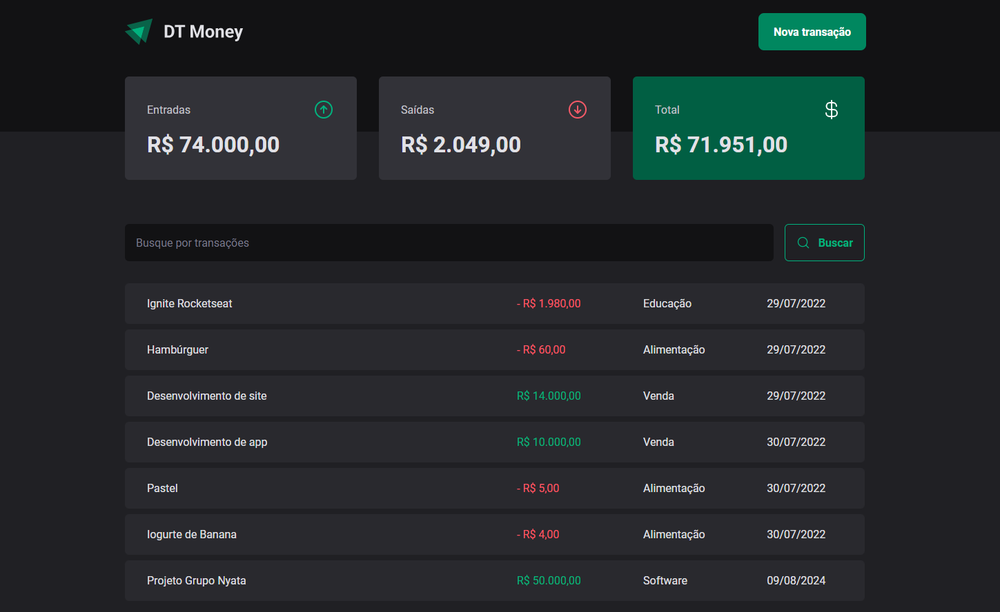

# Projeto Dt Money | Rocketseat

O DT Money é uma aplicação de controle financeiro desenvolvida para ajudar os usuários a gerenciar suas finanças pessoais de forma eficiente. A aplicação permite registrar e monitorar entradas e saídas de valores, calcular o total de transações e consultar informações detalhadas sobre cada movimentação financeira.




### Veja o projeto online

 ✅ https://dt-money-react-rocketseat.vercel.app/  

### Tecnologias Utilizadas

- React: ^18.3.1
- Typescript: ^5.2.2

### Funcionalidades

- [x] Cadastro de Entradas e Saídas:

  Entradas: Usuários podem registrar todas as receitas, como salários, vendas, ou qualquer outra fonte de entrada de dinheiro.
Saídas: Permite o registro de despesas, como contas, compras e qualquer outra saída de dinheiro.  

- [x] Consulta de Entradas e Saídas:

  Visualização Detalhada: Usuários podem visualizar uma lista completa de todas as entradas e saídas registradas, com informações como data, descrição e valor.
Filtros: A aplicação permite filtrar as transações por data, tipo (entrada ou saída) e categoria, facilitando a análise das finanças.

- [x] Cálculo de Total:

  Saldo Atual: A aplicação calcula automaticamente o saldo atual com base nas entradas e saídas registradas, fornecendo uma visão clara da situação financeira do usuário.
Resumo: Um resumo financeiro que apresenta o total de entradas, saídas e o saldo final.

### Aprendizado

- axios;
- Styled-components;
- Radix UI;
- Contextos;
- Reducers;
- Biblioteca axios;
- json-server;
- React Hook Form;
- Validação utilizando o Hook Form Resolvers e Zod;

### 📦 Bibliotecas

⬇️ Permite que você escreva CSS dentro dos seus componentes React usando uma sintaxe de template literals. Em vez de criar arquivos CSS separados ou usar classes CSS tradicionais.

```
npm i styled-components
npm i @types/styled-components -D
```

<br>

⬇️Biblioteca Eslint é uma ferramenta de linting para JavaScript e TypeScript. Ela é usada para identificar e corrigir problemas no código, garantindo a qualidade e a consistência do código-fonte.

```
npm i eslint -D
```

<br>

Biblioteca de icones para o projeto: https://phosphoricons.com/

```
npm i phosphor-react
```

<br>

⬇️é uma ferramenta popular para gerenciar formulários em aplicações React. Ela facilita a manipulação de formulários, fornecendo uma API simples e eficiente para gerenciar o estado dos campos, validação e submissão.

```
npm i react-hook-form
```

<br>

⬇️uma ferramenta para validação de esquemas em JavaScript e TypeScript. Ela é usada para definir e validar dados com base em esquemas,

```
npm i zod
```

<br>

⬇️Este pacote faz parte da biblioteca Radix UI, que fornece uma série de componentes de interface acessíveis e não estilizados para React.

```
npm install @radix-ui/react-dialog
```
<br>

⬇️Este pacote faz parte da biblioteca Radix UI e fornece um componente de grupo de botões de rádio para React.

```
npm install @radix-ui/react-radio-group
```

<br>

⬇️Biblioteca para intregar a zod com a Hook form

```
npm i @hookform/resolvers
```
<br>

⬇️Biblioteca capaz de criar uma API Fake em 30 segundos e sem precisar escrever nenhuma linha de código.
```
npm i json-server -D api completa para conectar com backend
```
<br>


⬇️Biblioteca que permite uma integração do seu projeto React para qualquer serviço de API disponível.

```
npm i axios
```
<br>

⬇️Instala dois pacotes no seu projeto Node.js:

use-context-selector: Um pacote para gerenciamento eficiente do contexto no React.<br>
scheduler: Um pacote que faz parte da biblioteca React e é utilizado para o agendamento de atualizações de estado e efeitos.

```
npm i use-context-selector scheduler
```
<br>


### Comandos

Comando para vasculhar erros do eslint no código

```
npx eslint src --ext .ts, .tsx
```

Comando para corrir todos os erros no eslint automaticamente em todo o projeto.

```
npx eslint src --ext .ts, .tsx --fix
```

### Como Executar o Projeto

1. Clone o repositório:

   ```bash
    https://github.com/DevGabrielrr/DtMoney-react-rocketseat.git 
   ```

2. Navegue até o diretório do projeto:

   ```bash
   cd nome-do-repositorio
   ```

3. Atualize o projeto, Em seu terminal e na pasta do projeto

   ```bash
   npm install
   ```

4. Rodar o projeto

   ```bash
   npm run dev
   ```
